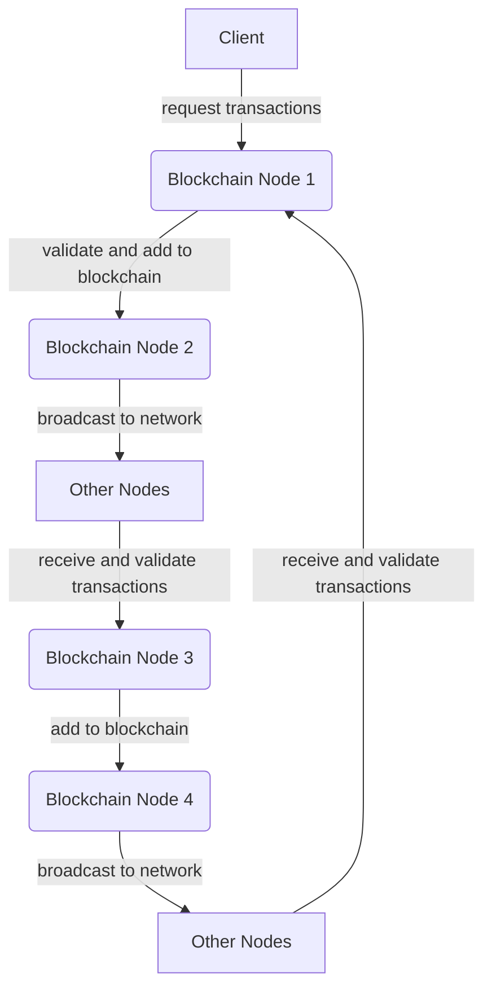

# blockchain-python
Personal project for study blockchain

To-do:

- [] Adjust wallet module to use grpc instead of import the blockchain function
- [] Integrate service discovery with the blockchain grpc
- [] Fix genesis block as it is not creating the Meikle tree until receive another transaction 
- [] Add signature validation before add the blocks
