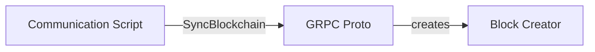

Block Creator
The block_creator module contains a Block class that represents a block in the blockchain. It has several properties such as the block's timestamp, a list of transactions, the previous block's hash, and the block's nonce. The Block class also has a hash_block method that hashes the block's contents using SHA-256.

The block_creator module has a create_genesis_block function that creates the first block in the blockchain. It also has a create_new_block function that creates a new block using the previous block's hash and a list of transactions.

Communication Scripts
The communication scripts include the blockchain_server.py and blockchain_client.py files.

The communicationr.py file starts a gRPC server that listens for incoming connections from other nodes in the blockchain network. It has several gRPC methods, including AddBlock and SyncBlockchain, that allow nodes to add blocks to the blockchain and synchronize their blockchain with other nodes.
